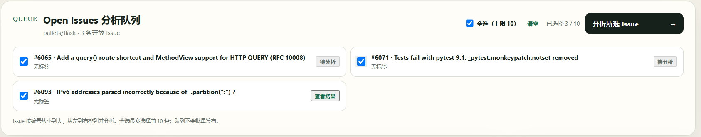
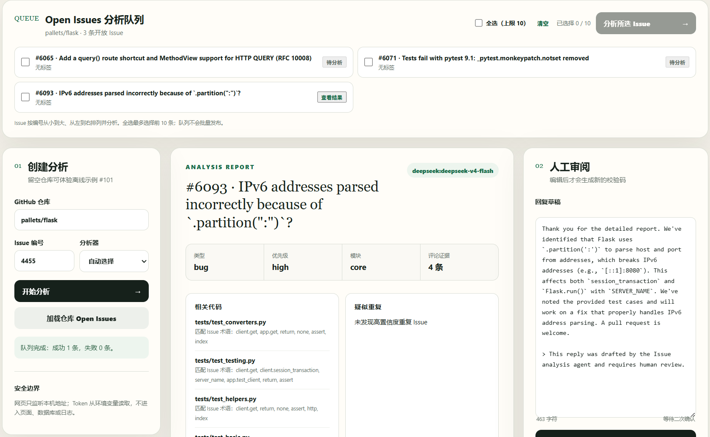
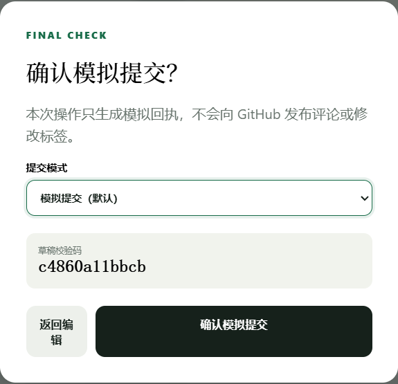
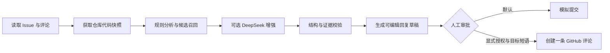

# Issue Lens：证据优先的 GitHub Issue 管理 Agent

Issue Lens 是一个面向开发团队的 GitHub Issue 分析与人工审批工作台。它读取 Issue、评论和仓库代码，自动完成分类、重复检测、相关文件定位、复现信息整理、修复建议与回复草稿生成；任何 GitHub 写操作都必须经过人工复核和目标级二次确认。

> 项目定位：可本地运行、可审计、默认只读的 AI Agent 作品集项目，而不是自动修改仓库的黑盒机器人。

## 核心能力

| 能力 | 实现方式 |
| --- | --- |
| Issue 分诊 | 识别类型、优先级和所属模块 |
| 重复检测 | 从历史 Issues 中召回候选并给出匹配证据 |
| 代码定位 | 浅克隆公开仓库，检索源码、测试和依赖配置 |
| 分析报告 | 生成复现步骤、待确认信息、修复方向和回复草稿 |
| 批量处理 | 加载 Open Issues，全选或选择最多 10 条顺序分析 |
| LLM 增强 | DeepSeek 生成结构化结果，失败时回退到规则分析 |
| 人工审批 | 草稿编辑、校验码、模拟提交和目标级真实发布确认 |
| 审计追踪 | 使用 SQLite 保存分析记录、审批状态和审计事件 |

## 产品界面

### 1. 批量 Issue 分析队列

Issue 按编号升序排列，支持全选、清空和顺序分析；批量功能只执行分析，不会批量发布评论。



### 2. 基于证据的分析报告

报告将分类结果、评论证据、重复候选、相关文件、复现信息、修复方向和回复草稿放在同一审核界面中。



### 3. 人工审批与安全确认

提交模式始终默认为模拟提交。草稿被编辑后会重新生成校验码；真实发布还必须显式切换模式并输入 `PUBLISH owner/repo#编号`。

<p align="center">
  
</p>

## 工作流程



更完整的数据流、模块职责、信任边界和失败处理见 [架构文档](docs/architecture.md)。

## 技术栈

- Python 3.13、FastAPI、Jinja2、原生 JavaScript
- GitHub REST API、Git 浅克隆与本地代码检索
- DeepSeek API 与结构化 JSON 校验
- SQLite 审批状态和审计记录
- Docker Compose、GitHub Actions、`unittest`

## 快速开始

### 方式一：直接运行

```powershell
py -m venv .venv
.\.venv\Scripts\Activate.ps1
python -m pip install -r requirements.txt
python web_main.py
```

打开 `http://127.0.0.1:8000`。不填写仓库、输入 Issue `101`，即可体验完全离线的演示数据。

### 方式二：Docker Compose

```powershell
Copy-Item .env.example .env
docker compose up --build
```

打开 `http://127.0.0.1:8000`。停止服务：

```powershell
docker compose down
```

Compose 只绑定本机回环地址 `127.0.0.1`，并默认关闭 GitHub 写入能力。

## 分析真实 GitHub Issue

### 严格只读模式

公开仓库可以匿名读取；配置只读 Token 可获得更高的 API 请求额度：

```powershell
$env:GITHUB_TOKEN = "你的只读 Token"
py main.py --repo owner/repo --issue 123
```

程序通过 GitHub REST API 获取 Issue、评论和历史候选，并将公开仓库浅克隆到 `.cache/github/owner/repo` 进行代码检索。Issues 接口中的 Pull Request 会被排除。

### DeepSeek 增强

```powershell
$env:LLM_PROVIDER = "deepseek"
$env:DEEPSEEK_API_KEY = "你的 API Key"
$env:LLM_MODEL = "deepseek-v4-flash"
py main.py --repo owner/repo --issue 123
```

模型输出必须通过结构校验和证据约束。请求失败、空响应或结果不合法时，系统重试一次，随后自动回退到确定性规则分析，并通过 `provider_warning` 说明原因。

## 受控的真实评论发布

该能力只应在你有权限的测试仓库中启用。读取与写入使用不同 Token；写入 Token 应只授权目标仓库，并仅授予 `Issues: Read and write`。

```powershell
$env:ENABLE_GITHUB_WRITE = "true"
$env:GITHUB_WRITE_TOKEN = "你的独立写入 Token"
py web_main.py
```

真实发布必须同时满足：

1. 服务端显式设置 `ENABLE_GITHUB_WRITE=true`。
2. 使用独立的 `GITHUB_WRITE_TOKEN`。
3. 人工审核当前回复草稿并确认对应校验码。
4. 将提交模式从默认的“模拟提交”切换为“真实发布”。
5. 准确输入目标短语 `PUBLISH owner/repo#编号`。

写入客户端只有“创建一条 Issue 评论”这一项操作，不能关闭 Issue、修改标签或删除内容。

## 安全与可靠性设计

- Issue 正文、评论、仓库文件和模型输出均按不可信输入处理。
- GitHub 读取客户端与写入客户端分离，写入能力默认关闭。
- Token 只从环境变量读取，不进入日志、SQLite、JSON 输出或仓库缓存。
- 只有 `OWNER`、`MEMBER` 或 `COLLABORATOR` 的明确评论可作为维护策略与版本承诺的依据。
- 模型不得根据缺失的 timeline 或单纯的 Issue 状态猜测关闭原因。
- 单条批量任务失败不会阻塞后续 Issue；发布失败则保留草稿供修正后重试。
- 未增加登录、身份认证和 HTTPS 前，不应将启用写入的 Web 服务暴露到公网。

## 测试与质量门槛

```powershell
py -m unittest discover -s tests -v
py evaluate.py --min-score 0.80
```

当前测试套件包含 35 项自动化测试，覆盖分析器、DeepSeek 校验与回退、GitHub 读写边界、审批状态机和 Web API。GitHub Actions 会在每次 push 和 pull request 时执行：

- 单元与集成测试
- 离线评测集质量门槛
- Python 语法编译检查
- Docker 镜像构建与容器内 Git 可用性检查

## 主要目录

```text
issue_agent/
├── analyzers.py       # 分类、重复检测、文件召回与修复建议
├── providers.py       # DeepSeek 调用、校验、重试和规则回退
├── github_readonly.py # GitHub 只读 API 与公开仓库快照
├── github_write.py    # 独立鉴权、仅评论的写入客户端
├── workflow.py        # 分析编排与审批状态流转
├── audit.py           # SQLite 运行记录与审计事件
└── web.py             # FastAPI 接口与 Web 工作台
```

## 命令行示例

```powershell
# 离线演示
py main.py --issue 101

# 查看结构化 JSON
py main.py --issue 101 --json

# 执行离线模拟审批
py main.py --issue 101 --approve

# 指定分析器
py main.py --issue 101 --provider heuristic
py main.py --issue 101 --provider deepseek --json
```

真实 GitHub 只读模式禁止通过 CLI 的 `--approve` 触发写操作。

## 当前边界

- Git 快照仅支持公开仓库，尚未接入私有仓库克隆。
- 批量分析由浏览器顺序执行，并非持久化后台任务队列。
- Web 工作台没有用户登录，当前定位为本机工具。
- GitHub 写入仅支持创建评论，不修改标签和 Issue 状态。
- 离线评测集规模较小，需要持续加入真实失败案例。

## 求职材料

可直接用于简历和面试介绍的项目描述见 [项目介绍与面试讲稿](docs/project-description.md)。
