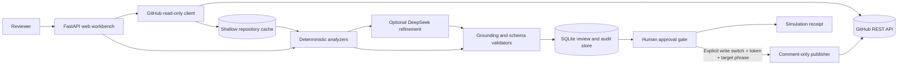

# Issue Lens architecture

## System flow

## Trust boundaries

- Issue bodies, comments, repository files, and model output are untrusted input.
- The read client exposes only `GET` operations. The write client is a separate class with one operation: create an Issue comment.
- `GITHUB_TOKEN` and `GITHUB_WRITE_TOKEN` are separate. Neither is stored in SQLite, JSON output, repository cache, or logs.
- Real writes require `ENABLE_GITHUB_WRITE=true`, a valid draft hash, and the exact phrase `PUBLISH owner/repo#number`.
- Maintainer policy claims are grounded only in comments whose association is `OWNER`, `MEMBER`, or `COLLABORATOR`.
- The Web app has no authentication and is intended for loopback-only use. The Compose port mapping binds to `127.0.0.1`.

## Main modules

| Module | Responsibility |
| --- | --- |
| `github_readonly.py` | Read Issues and comments; clone public repository snapshots |
| `analyzers.py` | Classification, duplicate retrieval, file retrieval, reproduction and fix plans |
| `providers.py` | DeepSeek structured refinement, validation, retry, and heuristic fallback |
| `workflow.py` | Analysis orchestration and approval state transitions |
| `audit.py` | Durable SQLite review runs and append-only audit events |
| `github_write.py` | Narrow, separately authenticated Issue comment publisher |
| `web.py` | HTTP API and local workbench composition |
| `evaluate.py` | Offline regression score used as a CI quality gate |

## Failure behavior

- GitHub and DeepSeek errors are returned as user-facing failures without exposing credentials.
- Invalid or hallucinated model output is retried once, then falls back to deterministic analysis.
- One failed item in the browser batch queue does not stop later items.
- A failed GitHub publish leaves the draft in confirmation state so the reviewer can correct permissions and retry.
- The application never silently changes an Issue, label, state, or comment.

## Current limitations

- Repository snapshots support public Git cloning only.
- Batch analysis runs sequentially in the active browser page rather than a durable worker queue.
- The evaluation set is intentionally small and should grow with real failure cases.
- Real GitHub mutation is limited to creating comments; label and state changes are out of scope.
